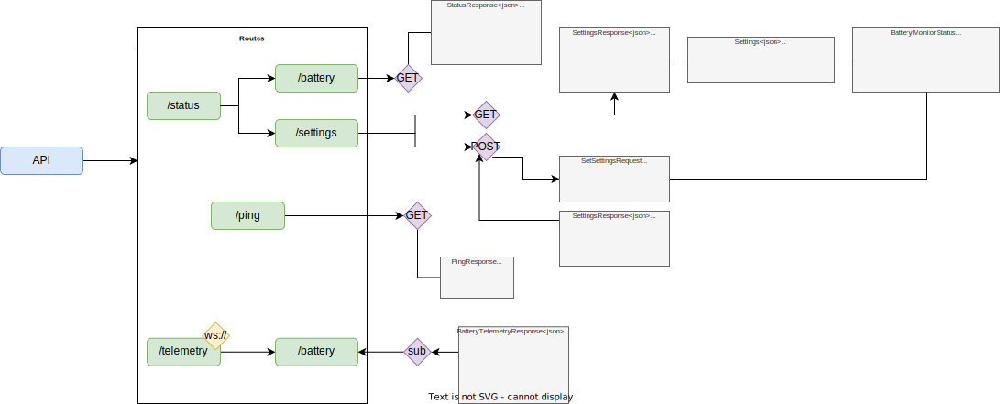

# DeckTweaks
A [decky-loader](https://github.com/SteamDeckHomebrew/decky-loader) homebrew plugin that contains configurable SteamDeck tweaks.

## Features
### Configuration
DeckTweaks configuration is stored under `/home/deck/.config/decktweaks`.
- Persistent settings are stored in `settings.json`.

### Battery Monitor
Backend API can monitor the battery percentage, providing feedback to the user (*through toast notification*) upon low battery charge
or a given max/min charge percentages.

<p align="center">
   
</p>

Notifications are issued based on the charge limits set, as shown below with a minimum charge limt of `30%` and max maximum charge limit
of `80%`:
<p align="center">
   
   
</p>

The user is also notified when the battery gets to a critical low charge state of `5%`:
<p align="center">
   
</p>


## Backend API
`development`: The backend server is written in go and can be built by invoking the [build.sh](backend/build.sh) script and then starting the server
manually using:
```sh
> server start
2022/10/15 17:53:18 Listening on localhost:3001.
```

<p align="center">
   
   </img>
</p>

# License
Licensed under [GNU GPLv3](LICENSE).
